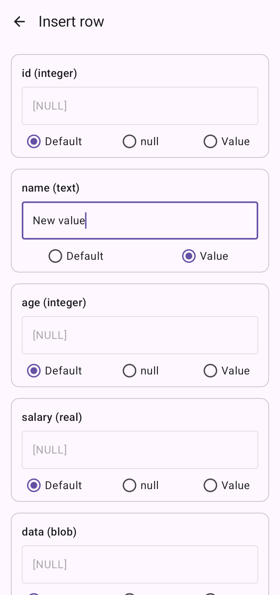
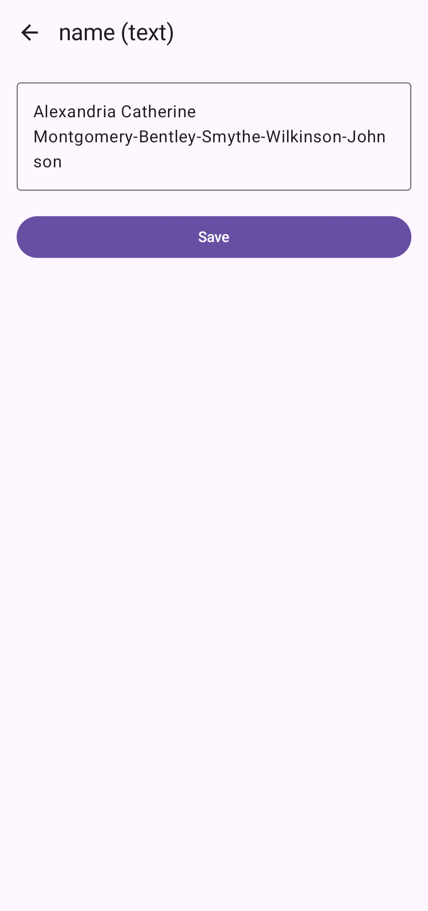
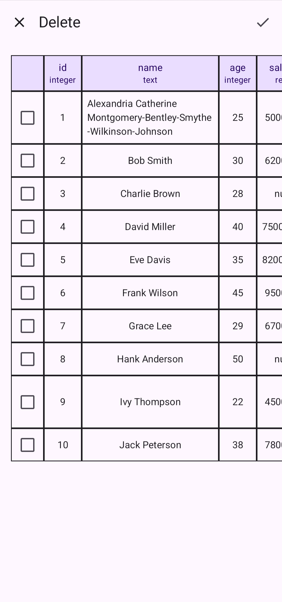

# Delight SQL Viewer

**Delight SQL Viewer** is a Kotlin Multiplatform library for Android, iOS, and Desktop applications. It supports both [SQLDelight](https://github.com/cashapp/sqldelight) and [Room Multiplatform](https://developer.android.com/kotlin/multiplatform/room) databases. With version **2.0.0**, developers and testers can view, edit, add, and delete records directly within the app—making debugging and QA efficient by enabling real-time inspection and modification of your app’s database state.

## Screenshots

<a href="content/screenshots/tables_list.png" target="_blank" rel="noopener noreferrer">
  
</a>
<a href="content/screenshots/table_content.png" target="_blank" rel="noopener noreferrer">
  
</a>
<a href="content/screenshots/insert_row.png" target="_blank" rel="noopener noreferrer">
  
</a>
<a href="content/screenshots/update_value.png" target="_blank" rel="noopener noreferrer">
  
</a>
<a href="content/screenshots/delete_rows.png" target="_blank" rel="noopener noreferrer">
  
</a>

## Features

- **Multiplatform Support:** Runs on Android, iOS, and Desktop.
- **Dual Database Support:** Seamlessly work with both SQLDelight and Room databases.
- **Database Inspection:** View, edit, add, and delete records directly from your app.
- **App Shortcuts (Android and iOS):** Automatically adds a shortcut entry for quick access (configurable).
- **Easy Integration:** Add the necessary dependencies and initialize in your platform-specific code.
- **Configurable for Debug/Release:** For debug builds, include full functionality; for release builds, switch to a lightweight stub to reduce app size.

## Table of Contents

1. [Installation](#installation)
2. [Initialization](#initialization)
   - [Android](#android)
   - [iOS](#ios)
   - [Desktop](#desktop)
3. [Launching the Viewer](#launching-the-viewer)
4. [Shortcuts](#shortcuts)
   - [Android Shortcut](#android-shortcut)
   - [iOS Shortcut](#ios-shortcut)
   - [Desktop](#desktop-shortcut)
5. [Excluding the Library in Release Builds](#excluding-the-library-in-release-builds)
   - [Using the Stub Library](#using-the-stub-library)
   - [Omitting Initialization and Launch](#omitting-initialization-and-launch)
6. [Contributing](#contributing)
7. [License](#license)

---

## Installation

Delight SQL Viewer is published to Maven Central. Add the dependency to your `shared` (common) module:

```kotlin
// In shared/build.gradle.kts

kotlin {
   sourceSets {
      val commonMain by getting {
         dependencies {
              api("ru.bartwell.delightsqlviewer:runtime:2.0.0")
              api("ru.bartwell.delightsqlviewer:core:2.0.0")
              // Choose the adapter based on your database:
              api("ru.bartwell.delightsqlviewer:sqldelight-adapter:2.0.0")
              // or
              // api("ru.bartwell.delightsqlviewer:room-adapter:2.0.0")
         }
      }
   }
}
```

For iOS, export the dependencies in your `framework {}` block to make them available in your iOS framework:

```kotlin
// In shared/build.gradle.kts

framework {
     export("ru.bartwell.delightsqlviewer:runtime:2.0.0")
     export("ru.bartwell.delightsqlviewer:core:2.0.0")
     // Choose the adapter based on your database:
     export("ru.bartwell.delightsqlviewer:sqldelight-adapter:2.0.0")
     // or
     // export("ru.bartwell.delightsqlviewer:room-adapter:2.0.0")
}
```

---

## Initialization

After adding the appropriate dependencies, initialize Delight SQL Viewer in your platform-specific code by providing the corresponding environment provider along with the database driver.

### Android

For **SQLDelight**:

```kotlin
DelightSqlViewer.init(object : SqlDelightEnvironmentProvider() {
    override fun getDriver() = sqlDelightDriver
    override fun getContext() = this@MainActivity
})
```

For **Room**:

```kotlin
DelightSqlViewer.init(object : RoomEnvironmentProvider() {
    override fun getDriver() = roomDatabase
    override fun getContext() = this@MainActivity
})
```

*Note:* Both providers require an Android `Context` along with the respective database instance.

### iOS

For **SQLDelight**:

```swift
let provider = SqlDelightEnvironmentProvider(driver: sqlDriver)
DelightSqlViewer.shared.doInit(provider: provider, isShortcutEnabled: true)
```

For **Room**:

```swift
let provider = RoomEnvironmentProvider(driver: roomDatabase)
DelightSqlViewer.shared.doInit(provider: provider, isShortcutEnabled: true)
```

*Note:* The `isShortcutEnabled` parameter determines whether a shortcut is added to the app icon.

### Desktop

For **SQLDelight**:

```kotlin
DelightSqlViewer.init(object : SqlDelightEnvironmentProvider() {
    override fun getDriver() = sqlDelightDriver
})
```

For **Room**:

```kotlin
DelightSqlViewer.init(object : RoomEnvironmentProvider() {
    override fun getDriver() = roomDatabase
})
```

- There is no built-in shortcut on Desktop. Simply call `DelightSqlViewer.launch()` from your own UI controls.

---

## Launching the Viewer

Once initialized, you can launch the viewer with a simple call:

### Android / Desktop

```kotlin
Button(onClick = { DelightSqlViewer.launch() }) {
    Text(text = "Launch viewer")
}
```

### iOS

```swift
Button("Launch viewer") {
    DelightSqlViewer.shared.launch()
}
```

---

## Shortcuts

### Android Shortcut

By default, Delight SQL Viewer adds a shortcut to your app’s launcher icon (accessible via long-press). To disable it, pass `isShortcutEnabled = false` during initialization:

```kotlin
DelightSqlViewer.init(
    object : AndroidEnvironmentProvider {
        override fun getDriver() = sqlDelightDriver // or roomDatabase for Room
        override fun getContext() = this@MainActivity
    },
    isShortcutEnabled = false
)
```

### iOS Shortcut

On iOS, the library adds a shortcut on the app icon by default. To handle shortcut actions, configure your `AppDelegate` or `UISceneDelegate` as follows:

```swift
class AppDelegate: NSObject, UIApplicationDelegate {
    func application(
        _ application: UIApplication,
        configurationForConnecting connectingSceneSession: UISceneSession,
        options: UIScene.ConnectionOptions
    ) -> UISceneConfiguration {
        return ShortcutActionHandler.shared.getConfiguration(session: connectingSceneSession)
    }
}
```

### Desktop Shortcut

Shortcuts are not supported on Desktop. Use your UI controls to manually trigger the viewer.

---

## Excluding the Library in Release Builds

Since the viewer is primarily for debugging and development, you may want to exclude it from release builds.

### Using the Stub Library

For release builds, depend on the stub module instead of the full implementation:

```kotlin
val isRelease = /* your logic to determine release vs. debug */

framework {
   if (isRelease) {
       // Use the stub library for release builds.
       export("ru.bartwell.delightsqlviewer:stub:2.0.0")
   } else {
       // Use the full implementation for debug builds.
       export("ru.bartwell.delightsqlviewer:runtime:2.0.0")
       export("ru.bartwell.delightsqlviewer:core:2.0.0")
       // Choose the appropriate adapter:
       export("ru.bartwell.delightsqlviewer:sqldelight-adapter:2.0.0")
       // or
       // export("ru.bartwell.delightsqlviewer:room-adapter:2.0.0")
   }
}
```

And in your dependencies:

```kotlin
dependencies {
    if (isRelease) {
        api("ru.bartwell.delightsqlviewer:stub:2.0.0")
    } else {
        api("ru.bartwell.delightsqlviewer:runtime:2.0.0")
        api("ru.bartwell.delightsqlviewer:core:2.0.0")
        // Choose the appropriate adapter:
        api("ru.bartwell.delightsqlviewer:sqldelight-adapter:2.0.0")
        // or
        // api("ru.bartwell.delightsqlviewer:room-adapter:2.0.0")
    }
}
```

### Omitting Initialization and Launch

Alternatively, you can simply avoid calling `DelightSqlViewer.init(...)` and `DelightSqlViewer.launch()` in release builds. However, using the stub dependency is generally preferred to prevent unnecessary code inclusion.

---

## Contributing

Contributions are welcome! Please feel free to open an issue or submit a pull request with any improvements or suggestions.

---

## License

```
Copyright 2025 Artem Bazhanov

Licensed under the Apache License, Version 2.0 (the "License");
you may not use this file except in compliance with the License.
You may obtain a copy of the License at

   http://www.apache.org/licenses/LICENSE-2.0
```

Delight SQL Viewer is distributed under the [Apache License, Version 2.0](http://www.apache.org/licenses/LICENSE-2.0).

---

**Happy debugging!** If you have any questions or need further assistance, feel free to open an issue.
